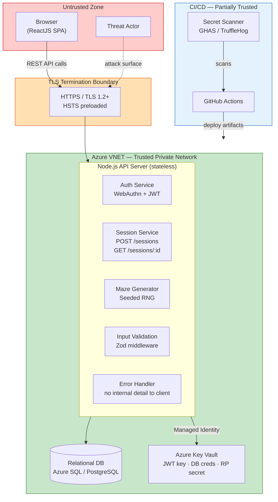
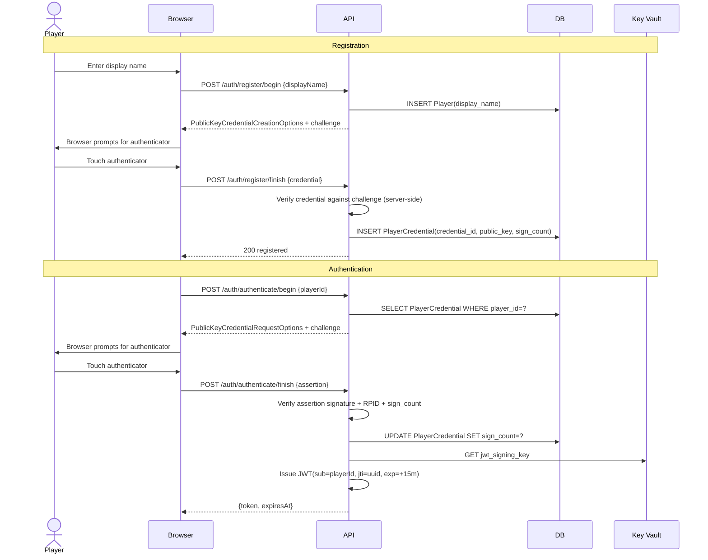
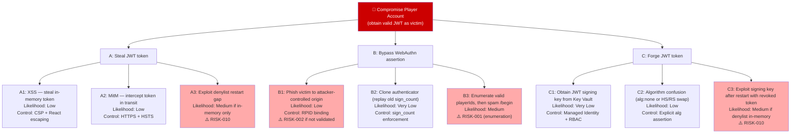
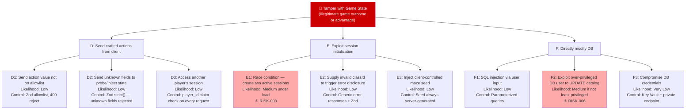
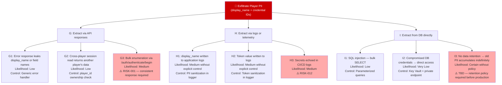

# Runebreach — Threat Model

**Method**: STRIDE per data flow, with attack trees for highest-risk scenarios.
**Date**: 2026-06-04 | **Status**: Bootstrap — no implementation yet; findings target the design.

---

## 1. System Overview

Runebreach is a server-authoritative web game. The client is a pure display/input layer; all state lives in the database. The server generates the maze, places items and monsters, and validates every player action. No game state is trusted from the client.

---

## 2. Assets and Security Goals

| Asset | Classification | Confidentiality | Integrity | Availability |
|---|---|---|---|---|
| Player display name | PII (GDPR) | High | Medium | Low |
| WebAuthn credential (public key, credential ID) | Auth material | Medium¹ | Critical | High |
| JWT signing key | Secret | Critical | Critical | High |
| WebAuthn RP secret | Secret | Critical | Critical | High |
| DB credentials | Secret | Critical | Critical | High |
| Active JWT tokens | Session | High | Critical | High |
| Game session state | Internal | Low | High | Medium |
| Maze seed | Internal | Medium² | High | Low |

> ¹ Credential IDs are not secret (WebAuthn design), but public keys must not be tampered with.
> ² Seed confidentiality prevents layout prediction; it does not need to be encrypted, only kept server-side.

---

## 3. Trust Boundaries and Data Flow

### Context Diagram

### Internal Data Flows

| ID | Flow | Trust Boundary Crossed |
|---|---|---|
| DF-1 | Browser → `POST /auth/register/begin` + `/finish` | Internet → API |
| DF-2 | Browser → `POST /auth/authenticate/begin` + `/finish` | Internet → API |
| DF-3 | Browser → `POST /sessions` | Internet → API (authenticated) |
| DF-4 | Browser → `GET /sessions/{id}` | Internet → API (authenticated) |
| DF-5 | API → Database (all queries) | API → Private DB |
| DF-6 | API → Azure Key Vault | API → Secrets store |
| DF-7 | GitHub Actions → Azure | CI/CD → Production |

---

## 4. Threat Actor Profiles

| Actor | Capability | Motivation |
|---|---|---|
| Unauthenticated attacker | Can send arbitrary HTTP requests | Account takeover, data theft, DoS |
| Authenticated player | Valid session token, own game state | Cross-player access, game state manipulation, cheating |
| Malicious insider | Code/repo access, CI/CD access | Supply chain injection, secret exfiltration |
| Compromised dependency | Code execution within Node.js process | Credential theft, data exfiltration |

---

## 5. Authentication Flow

---

## 6. STRIDE Analysis

### DF-1 / DF-2 — Registration and Authentication Endpoints

| # | Threat | STRIDE | Severity | Status | Finding |
|---|---|---|---|---|---|
| T-01 | Attacker floods `/register` or `/auth/begin` to exhaust DB connections or cause DoS | D | High | **Mitigated** | Stricter rate limiting on auth endpoints |
| T-02 | Replay attack: reuse a captured WebAuthn challenge | S | High | **Mitigated** | Challenges are single-use and short-lived |
| T-03 | Cloned authenticator: replay assertion with stale sign_count | S | High | **Mitigated** | sign_count must exceed stored value |
| T-04 | **Account enumeration**: `/authenticate/begin` returns a different response for unknown `playerId` vs. known, allowing ID harvesting | I | High | **GAP** → RISK-001 | Consistent response required regardless of player existence |
| T-05 | Challenge injection: attacker supplies their own challenge | T | Critical | **Mitigated** | Challenge is server-generated; client cannot influence it |
| T-06 | RPID spoofing: attacker hosts a phishing site and registers/asserts against a different origin | S | High | **GAP** → RISK-002 | RPID binding must be explicitly validated per SECURITY.md |
| T-07 | Registration with a chosen display name matching another player | S | Low | Accepted | Display name is not a security credential; player_id is the identity |
| T-08 | Missing timing side channel on registration response | I | Low | Accepted | No meaningful timing oracle in this flow |

### DF-3 — `POST /sessions` (Session Initialization)

| # | Threat | STRIDE | Severity | Status | Finding |
|---|---|---|---|---|---|
| T-09 | **Race condition**: two concurrent requests both pass the "one active session" API check before either inserts, creating two active sessions | T | High | **GAP** → RISK-003 | Atomic check-and-insert; DB unique constraint is the guard; constraint violation must map to 409 not 500 |
| T-10 | Supplying a `classId` not in the catalog to probe DB errors | I | Medium | **Mitigated** | Zod validation + parameterized query; catalog lookup before insert |
| T-11 | Game session never expires — resource exhaustion and stale token risk | D/E | Medium | **GAP** → RISK-004 | No session inactivity timeout defined |
| T-12 | Client-controlled maze properties via crafted body fields | T | High | **Mitigated** | Zod strict schema; unknown fields rejected; maze seed server-generated |

### DF-4 — `GET /sessions/{id}` and Future Game Action Endpoints

| # | Threat | STRIDE | Severity | Status | Finding |
|---|---|---|---|---|---|
| T-13 | Cross-player access: request another player's session ID | E | Critical | **Mitigated** | `token.player_id === GameSession.player_id` check on every request |
| T-14 | IDOR via session ID enumeration (sequential or predictable IDs) | I | High | **Mitigated** | Session IDs must be UUIDs (unguessable); DB validates ownership |
| T-15 | Client sends game action values not on the allowlist | T | High | **Mitigated** | Zod allowlist on action/move values; reject with 400 |
| T-16 | Missing CSRF protection | T | — | **N/A — document** → RISK-005 | Bearer token in Authorization header; CSRF not applicable for REST + Bearer. Document explicitly to prevent future implementation error. |

### DF-5 — API → Database

| # | Threat | STRIDE | Severity | Status | Finding |
|---|---|---|---|---|---|
| T-17 | SQL injection via user-supplied input | T | Critical | **Mitigated** | Parameterized statements required |
| T-18 | Over-privileged DB user modifies catalog tables at runtime | E | High | **GAP** → RISK-006 | Application DB role must be read-only on catalog tables; no DDL rights |
| T-19 | DB connection without TLS allows sniffing on internal network | I | Medium | **GAP** → RISK-007 | DB connections must enforce SSL; certificate validation enabled |
| T-20 | Slow-query or connection-pool exhaustion attack | D | Medium | **GAP** → RISK-008 | Query timeouts and connection pool max-size must be configured |
| T-21 | Mass data extraction via unparameterized batch operation | I | High | **Mitigated** | Parameterized queries + row-level ownership checks |

### DF-6 — API → Azure Key Vault

| # | Threat | STRIDE | Severity | Status | Finding |
|---|---|---|---|---|---|
| T-22 | Managed identity granted excessive Azure RBAC permissions | E | High | **GAP** → RISK-009 | Least-privilege managed identity: Key Vault Secrets User role only |
| T-23 | JWT signing key not rotated; compromised key used indefinitely | S | High | **GAP** (TBD) | Rotation schedule TBD per SECURITY.md; must be defined before production |
| T-24 | JWT denylist stored in-memory only; restart reactivates revoked tokens | S | Critical | **GAP** → RISK-010 | Denylist must persist across restarts (Redis with AOF/RDB or DB table) |

### DF-7 — CI/CD Pipeline

| # | Threat | STRIDE | Severity | Status | Finding |
|---|---|---|---|---|---|
| T-25 | Unpinned GitHub Actions version compromised by tag mutation | T | High | **GAP** → RISK-011 | Pin all Actions to specific commit SHA |
| T-26 | Secrets echoed in CI workflow logs | I | High | **GAP** → RISK-012 | Explicit secret masking required for all env secrets in workflow logs |
| T-27 | Malicious or vulnerable transitive dependency | T | High | **GAP** → RISK-013 | `package-lock.json` must be committed; dependency review Action on every PR |
| T-28 | Compromised PR merges malicious code that passes secret scan | T | Medium | Accepted (residual) | Mitigated by GHAS + human review; residual risk acknowledged |

---

## 7. Attack Trees

### Attack Tree 1: Compromise a Player Account

### Attack Tree 2: Tamper with Game State

### Attack Tree 3: Exfiltrate Player PII (GDPR Breach)

---

## 8. Risk Register

| ID | Threat | Component | Severity | Likelihood | Risk | Action |
|---|---|---|---|---|---|---|
| RISK-001 | Account enumeration via `/auth/authenticate/begin` | Auth | High | Medium | **High** | Fix in SECURITY.md |
| RISK-002 | RPID binding not explicit in security spec | Auth | High | Low | **Medium** | Fix in SECURITY.md |
| RISK-003 | Race condition on session creation — two active sessions | Session | High | Medium | **High** | Fix in SECURITY.md + ARCHITECTURE.md |
| RISK-004 | Game session never expires | Session | Medium | High | **High** | Fix in SECURITY.md |
| RISK-005 | CSRF scope undocumented | API | Low | High | **Medium** | Document in SECURITY.md |
| RISK-006 | DB application user can write to catalog tables | DB | High | Medium | **High** | Fix in SECURITY.md |
| RISK-007 | DB connection without TLS | DB | Medium | Medium | **Medium** | Fix in SECURITY.md |
| RISK-008 | No query timeout or connection pool limit | DB | Medium | Medium | **Medium** | Fix in SECURITY.md |
| RISK-009 | Over-privileged managed identity | Infra | High | Low | **Medium** | Fix in SECURITY.md |
| RISK-010 | JWT denylist in-memory only — survives restart gap | Auth | Critical | Medium | **Critical** | Fix in SECURITY.md |
| RISK-011 | Unpinned GitHub Actions versions | CI/CD | High | Medium | **High** | Fix in SECURITY.md |
| RISK-012 | Secrets echoed in CI/CD logs | CI/CD | High | Medium | **High** | Fix in SECURITY.md |
| RISK-013 | No `package-lock.json` / dependency review | CI/CD | High | Medium | **High** | Fix in SECURITY.md |
| RISK-014 | Incomplete Content-Security-Policy | Client | High | High | **High** | Fix in SECURITY.md |
| RISK-015 | Server fingerprinting via version headers | API | Low | High | **Medium** | Fix in SECURITY.md |

---

## 9. Residual / Accepted Risks

| Risk | Rationale |
|---|---|
| Phishing (non-origin-bound) | WebAuthn RPID binding makes phishing cryptographically impossible |
| Brute-force password attack | No passwords exist in this system |
| Session fixation | JWT is issued fresh on every authentication; no reuse |
| Credential stuffing | Passkey eliminates shared secrets |

---

## 10. Open Risks (Blocked on TBD Decisions)

These risks cannot be fully mitigated until the corresponding TBD items are resolved:

| Risk | Blocked On |
|---|---|
| Session timeout cannot be set | Win/loss conditions TBD — unclear when a session legitimately ends |
| Data retention policy | GDPR lawful basis and retention period TBD |
| JWT rotation schedule | Key rotation TBD |
| Combat action allowlist | Combat mechanics TBD |
